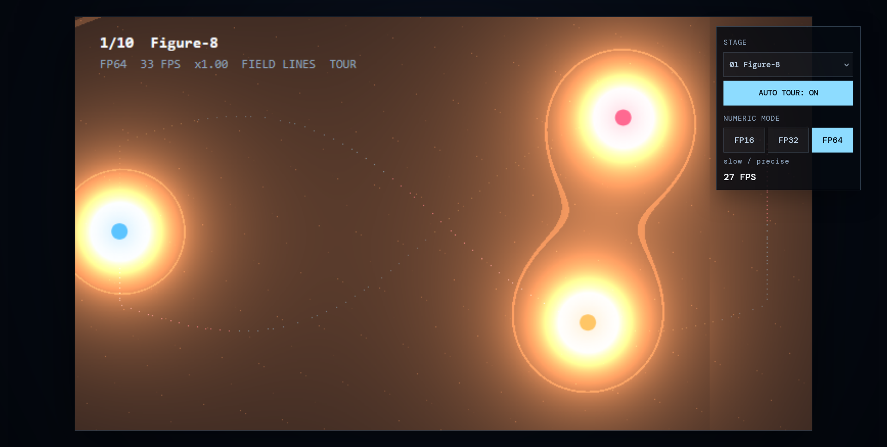
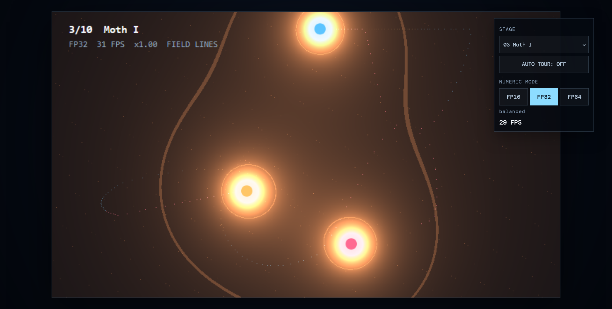

# Three Bodies

A live browser visualization of the gravitational three-body problem. Three point masses move under Newtonian gravity while an HTML canvas renders their light, field lines, stars, and trails.

This project is a TypeScript/Vite browser implementation inspired by the original [Bend three-bodies project](https://github.com/AdrielSantana/three-bodies), whose GPU-oriented description is included below as the reference implementation. This version runs entirely in the browser and uses typed arrays for its numeric storage and pixel buffers.





## Running it

Install dependencies and start the Vite development server:

```bash
npm install
npm run dev
```

Then open the local URL printed by Vite.

Create a production build with:

```bash
npm run build
```

The build runs TypeScript checking before producing the Vite bundle in `dist/`.

## GitHub Pages

The repository deploys automatically from `main` through [`.github/workflows/deploy-pages.yml`](.github/workflows/deploy-pages.yml).

Live site: <https://debadityamalakar.github.io/ThreeBodies/>

In the repository settings, set **Pages > Build and deployment > Source** to **GitHub Actions**. A push to `main` then builds and publishes the site.

## Controls

The HUD provides:

- **Stage**: choose one of the ten scenarios directly.
- **Auto Tour**: move through scenarios automatically when enabled.
- **Numeric mode**: switch between FP16, FP32, and FP64 storage.
- **FPS**: view the rolling frame-rate estimate.

Keyboard controls:

| Key | Action |
| --- | --- |
| `1`-`9`, `0` | Select a scenario |
| `N` / `B` or `Right` / `Left` | Next / previous scenario |
| `R` | Restart the current scenario |
| `Space` | Pause or resume |
| `Up` / `Down` | Increase or decrease simulation speed |
| `G` | Toggle field lines |
| `T` | Toggle the automatic tour |

Selecting a stage from the HUD disables Auto Tour so the chosen scenario remains active.

## Numeric modes

The simulation keeps its scalar values in typed arrays:

- **FP16**: compact half-precision storage. It is the fastest compact mode, but has the lowest precision and rendering is not guaranteed for every scenario.
- **FP32**: the balanced default for speed and stability.
- **FP64**: `Float64Array` storage for the most precise browser mode, with a higher computational cost.

All modes use bounded work per frame so precision-induced timestep collapse cannot block the UI. FP16 and FP64 still use a minimum timestep guard to keep the animation responsive when quantization or close encounters make the adaptive pace very small.

The renderer uses a lower internal raster and dynamically scales it to the viewport. The camera zooms out when bodies approach the edge, keeping entities and trails visible on phones, tablets, desktop displays, and WUXGA-sized screens.

## Scenarios

| # | Scenario |
| --- | --- |
| 1 | Figure-8 |
| 2 | Butterfly I |
| 3 | Moth I |
| 4 | Yin-Yang I |
| 5 | Yarn |
| 6 | Lagrange triangle |
| 7 | Pythagorean 3-4-5 |
| 8 | Star, planet and moon |
| 9 | Two stars and a planet |
| 0 | Chaos: three random masses |

The first five are periodic solutions. The Lagrange triangle is unstable for equal masses. The chaos scenario generates a new randomized system whenever it is loaded.

## How it works

### Physics

- Three point masses interact under Newtonian gravity with a small collision softening term.
- Positions and velocities use a double-single representation: a high part and a residual part stored through the active numeric mode.
- Integration uses a fourth-order Forest-Ruth composition of three leapfrog steps.
- The timestep follows the tightest pair's free-fall and fly-by scale.
- Each frame has a bounded physics budget so difficult encounters do not freeze input or rendering.

### Canvas renderer

- Every frame is generated into an `ImageData` buffer and displayed with `putImageData`.
- The pixel pass combines body glare, field contours, stars, and typed-array trail data.
- `Uint8ClampedArray` stores trail intensity, while the scalar simulation uses FP16, FP32, or FP64 typed-array storage.
- The canvas is dynamically fitted to the available viewport while retaining a 16:9 aspect ratio.

## Reference implementation

The original Bend project describes a different execution model:

> The gravitational three-body problem, live, written in [Bend](https://bend-lang.com). The physics runs on the CPU; every pixel of every frame is computed on the GPU.

Its native workflow is:

```bash
curl -fsSL https://bend-lang.com/install.sh | sh
bend main.bend -o tres && ./tres
```

That implementation produces `tres` and `tres.gpu`, uses Bend's GPU backend by default, and includes formal laws and proofs. Those Bend-specific commands and files are reference material for the original project and are not required by this browser version.

## Files

| File | Contents |
| --- | --- |
| `index.html` | Canvas and HUD markup |
| `src/main.ts` | Physics, scenarios, typed-array numeric modes, renderer, controls, and animation loop |
| `src/style.css` | Responsive canvas and HUD styling |
| `assets/` | Captured stage screenshots |
| `package.json` | Vite scripts and TypeScript dependencies |

## License

This project is licensed under the [MIT License](LICENSE).

Reference project: [AdrielSantana/three-bodies](https://github.com/AdrielSantana/three-bodies)
